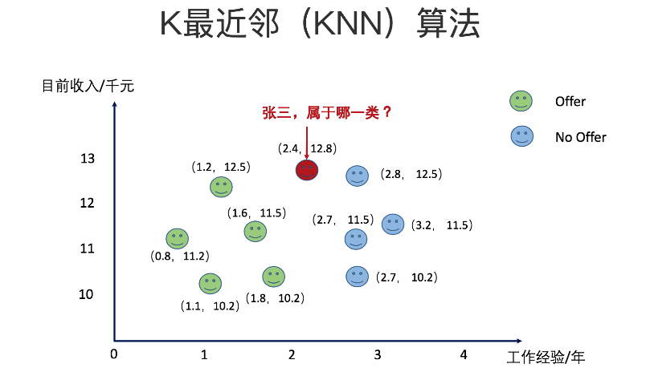
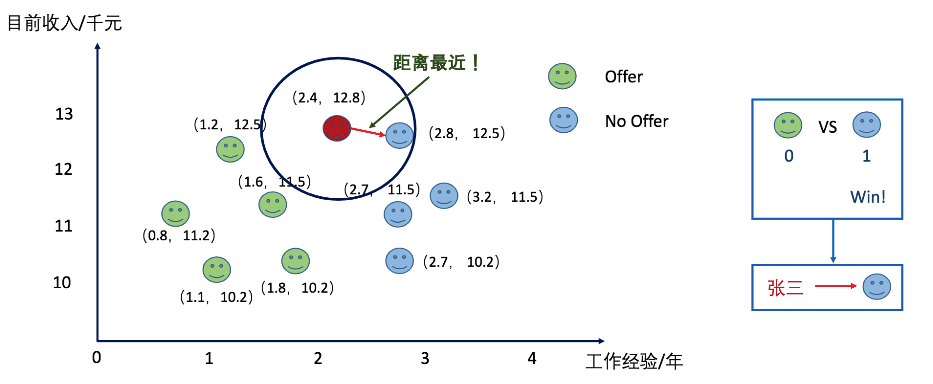
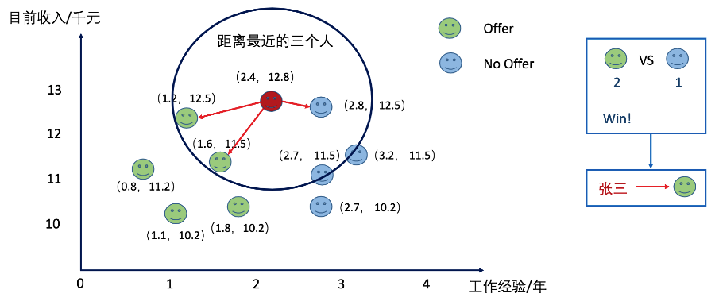
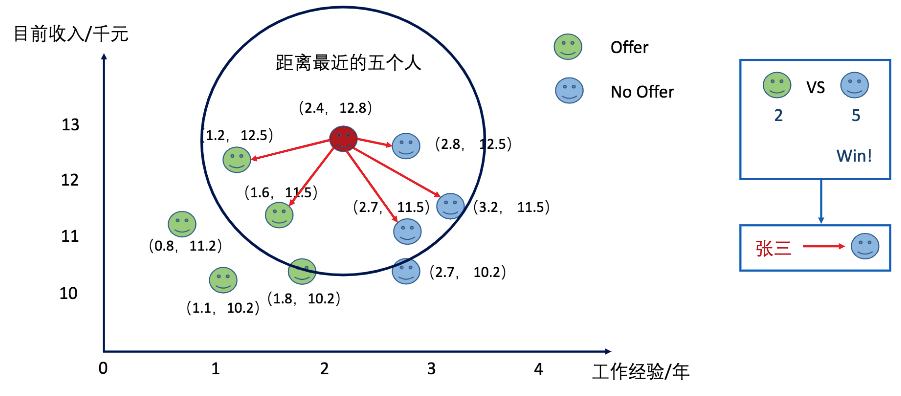
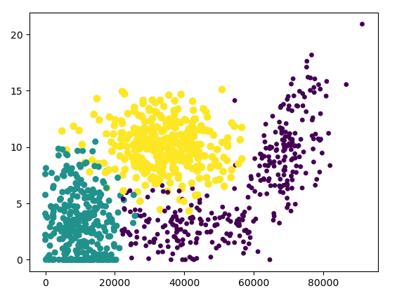

# K-临近算法讲解

## **1 KNN概述**

&#160; &#160; &#160; &#160;k-近邻（kNN, k-NearestNeighbor）算法是一种基本分类与回归方法，我们这里只讨论分类问题中的 k-近邻算法。

&#160; &#160; &#160; &#160;首先我们假设一个场景，已有M个人分成了n个兴趣小组分开站在一起，这时来了一些新人，需要加入这些群体，但是如何去将他们分配到合适的群体呢。一般来说我们肯定会按照新人的兴趣来分配小组，即新人和哪个小组成员比较相似就将新人分配到哪个小组。

&#160; &#160; &#160; &#160;这时又会有一个新的问题产生，如何去度量新人与小组之间的相似度呢？那么，对于KNN算法来说，我们使用新人与小组内成员特征的距离来计算相似度，即距离越近相似度越大。

&#160; &#160; &#160; &#160;**也就是中国古话所说的：近朱者赤近墨者黑！**

&#160; &#160; &#160; &#160;现在根据上面我们得到的已有小组中所有成员与新人的距离，按照距离递增排序，可以找到k个距离最近的成员，根据k个成员对新人的分配决策。

&#160; &#160; &#160; &#160;根据以上实例其实就可以得到一个KNN模型，但是这其中有三个值得去商讨的点，即KNN模型的三个基本要素：距离度量、k值的选择和分类决策规则。

## **2 KNN 原理**

### 2.1 距离度量

&#160; &#160; &#160; &#160;特征空间中两个实例点的距离是两个实例点相似程度的反映。k近邻模型的特征空间一般是n维实数向量空间$\textbf{R}^n$。一般我们使用的距离都是欧氏距离，但也可以是其他距离，如更一般的$L_p$。距离（$L_p$ distance）或Minkowski距离（Minkowski distance）。

&#160; &#160; &#160; &#160;设特征空间 $X$ 是n维实数向量空间$\textbf{R}^n$，$x_i,x_j\in X$，$x_i=(x_{i}^{(1)},x_{i}^{(2)},\cdots,x_{i}^{(n)})^T$，$x_j=(x_{j}^{(1)},x_{j}^{(2)},\cdots,x_{j}^{(n)})^T$，$x_j,x_j$的$L_p$距离定义为

$$L_p(x_i,x_j)=\left(\sum_{l=1}^n\left|x_{i}^{(l)}-x_{j}^{(l)}\right|^p\right)^{\frac{1}{p}}$$

&#160; &#160; &#160; &#160;这里$p\ge1$。当$p=2$时，称为欧氏距离（Euclidean distance），也是我们KNN算法最常用的度量距离的算法，即

$$L_2(x_i,x_j)=\left(\sum_{l=1}^n\left|x_{i}^{(l)}-x_{j}^{(l)}\right|^2\right)^{\frac{1}{2}}$$

&#160; &#160; &#160; &#160;当$p=1$时，称为曼哈顿距离（Manhattandistance），即

$$L_1(x_i,x_j)=\sum_{l=1}^n\left|x_{i}^{(l)}-x_{j}^{(l)}\right|$$

&#160; &#160; &#160; &#160;当$p=\infty$时，它是各个坐标距离的最大值，即

$$L_\infty(x_i,x_j)=\max\limits_{l}\left|x_{i}^{(l)}-x_{j}^{(l)}\right|$$

### 2.2 k值的选择

&#160; &#160; &#160; &#160;k值的选择会对k近邻法的结果产生重大影响。

&#160; &#160; &#160; &#160;如果选择较小的k值，就相当于用较小的邻域中的训练实例进行预测，"学习"的近似误差会减小，只有与输入实例较近的（相似的）训练实例才会对预测结果起作用.但缺点是"学习"的估计误差（estimationeror）会增大，预测结果会对近邻的实例点非常敏感叫.如果邻近的实例点恰巧是噪声，预测就会出错.换句话说，k值的减小就意味着整体模型变得复杂，容易发生过拟合。

&#160; &#160; &#160; &#160;如果选择较大的k值，就相当于用较大邻域中的训练实例进行预测.其优点是可以减少学习的估计误差.但缺点是学习的近似误差会增大.这时与输入实例较远的（不相似的）训练实例也会对预测起作用，使预测发生错误，k值的增大就意味着整体的模型变得简单。

&#160; &#160; &#160; &#160;如果$k=N$，那么无论输入实例是什么，都将简单地预测它属于在训练实例中最多的类.这时，模型过于简单，完全忽略训练实例中的大量有用信息，是不可取的。

&#160; &#160; &#160; &#160;在应用中，k值一般取一个比较小的数值．通常采用交叉验证法来选取最优的k值。

### 2.3 分类决策规则

&#160; &#160; &#160; &#160;k近邻法中的分类决策规则往往是多数表决，即由输入实例的k个邻近的训练实例中的多数类决定输入实例的类。对于上面的简单示例来说，就是按照距离最近的k个成员的组别，决定新人的组别，即在k个最近成员中，哪个组别的人最多，该新人就属于该组别。

### 2.4 KNN算法步骤

```txt
1. 假设有一个带有标签的样本数据集（训练样本集），其中包含每条数据与所属分类的对应关系。
2. 输入没有标签的新数据后，将新数据的每个特征与样本集中数据对应的特征进行比较。
    1. 计算新数据与样本数据集中每条数据的距离。
    2. 对求得的所有距离进行排序（从小到大，越小表示越相似）。
    3. 取前k（k一般小于等于20）个样本数据对应的分类标签。
3. 求k个数据中出现次数最多的分类标签作为新数据的分类。
```

### 2.5 KNN 通俗理解

&#160; &#160; &#160; &#160;给定一个训练数据集，对新的输入实例，在训练数据集中找到与该实例最邻近的 k 个实例，这 k 个实例的多数属于某个类，就把该输入实例分为这个类。

&#160; &#160; &#160; &#160;下面我们用一个具体可视化实例来讲解一下：



&#160; &#160; &#160; &#160;如上图所描述张三要参加一家公司的面试，他通过各种渠道了解到了一些工作年限和工资之间对应的关系以及在这种条件下他们是否获取到了offer的情况。让我们来预测一下张三是否能够拿到他这家公司的offer吧？当K-近邻中的K选择为1的时候我们看下结果。最小距离为：$\sqrt{(2.4-2.8^2)+(12.8-12.5)^2}=0.5$。张三不可以拿到offer。



&#160; &#160; &#160; &#160;当我们选择K的值为3的时候，张三拿到了offer。



同理当我们选择K的值为5的时候呢？张三被分类到了拿不到offer的类别上了。



### 2.6 KNN 算法特点

1. 优点: 精度高、对异常值不敏感、无数据输入假定
2. 缺点: 计算复杂度高、空间复杂度高
3. 适用数据范围: 数值型和标称型

## **3 KNN项目案例**

完整代码地址：<https://github.com/LuTiantian-0406/Machine-learning-matlab-python/blob/master/KNN/example1/DatingKnn.py>

### 3.1 项目案例1: 优化约会网站的配对效果

#### ***3.1.1 项目概述***

海伦使用约会网站寻找约会对象。经过一段时间之后，她发现曾交往过三种类型的人:

* 不喜欢的人
* 魅力一般的人
* 极具魅力的人

她希望:

* 工作日与魅力一般的人约会
* 周末与极具魅力的人约会
* 不喜欢的人则直接排除掉

现在她收集到了一些约会网站未曾记录的数据信息，这更有助于匹配对象的归类。

#### ***3.1.2 特征数据***

约会的对象主要包含以下 3 种特征：

* 每年获得的飞行常客里程数
* 玩视频游戏所耗时间百分比
* 每周消费的冰淇淋公升数

如下是数据格式：

|飞行里程|游戏耗时|消费冰淇淋|样本分类|
|-|-|-|-|
|40920|8.326976|0.953952|3|
|14488|7.153469|1.673904|2|
|26052|1.441871|0.805124|1|
|75136|13.147394|0.428964|1|
|38344|1.669788|0.134296|1|

#### ***3.1.3 代码***

>准备数据：将将文本记录转换为 NumPy 的解析程序

```python
def file2matrix(filename):
    """
    Desc:
        导入训练数据
    parameters:
        filename: 数据文件路径
    return:
        数据特征矩阵 returnMat 和对应的类别 classLabelVector
    """
    data = open(filename)
    numberOfLines = len(data.readlines())  # 获得文件中的数据行的行数
    returnMat = np.zeros((numberOfLines, 3))  # 生成对应的全零矩阵
    classLabelVector = []
    index = 0
    data = open(filename)
    for line in data.readlines():
        line = line.strip()  # 去除字符首尾的空格
        listFromLine = line.split('\t')  # 以 '\t' 切割字符串
        returnMat[index, :] = listFromLine[0:-1]  # 每列的特征数据
        classLabelVector.append(int(listFromLine[-1]))  # 每列的类别数据
        index += 1
    return returnMat, classLabelVector
```

>可视化数据：使用 Matplotlib 画二维散点图

```python
import matplotlib
import matplotlib.pyplot as plt
fig = plt.figure()
ax = fig.add_subplot(111)
ax.scatter(datingDataMat[:, 0], datingDataMat[:, 1], 15.0*array(datingLabels), 15.0*array(datingLabels))
plt.show()
```

&#160; &#160; &#160; &#160;下图中采用矩阵的第一和第二列属性得到很好的展示效果，清晰地标识了三个不同的样本分类区域，具有不同爱好的人其类别区域也不同。



>归一化数据：本文使用的是线性函数转换

&#160; &#160; &#160; &#160;归一化定义: 我认为归一化就是要把你需要处理的数据经过处理后（通过某种算法）限制在你需要的一定范围内。首先归一化是为了后面数据处理的方便，消除特征之间量级不同导致的影响；其次是保正程序运行时收敛加快。很好理解：0.01Kg的物体和1g的物体在数值上1g的物体大，但实际重量上是0.01Kg的物体重，这就是为什么我们要归一化处理数据。

归一化方法有很多：线性函数转换、对数函数转换、反余切函数转换等等，本文使用线性函数转换

$$x'=(x - X_{min}) / (X_{max}-X_{min})$$

```python
def autoNorm(dataSet):
    """
    Desc:
        归一化特征值，消除特征之间量级不同导致的影响
    parameter:
        dataSet: 数据集
    return:
        归一化后的数据集 normDataSet. ranges和minVals即最小值与范围，并没有用到
    """
    minVals = dataSet.min(0)
    maxVals = dataSet.max(0)
    ranges = maxVals - minVals  # 计算极差
    normDataSet = np.zeros(np.shape(dataSet))
    m = dataSet.shape[0]
    normDataSet = dataSet - np.tile(minVals, (m, 1))  # 生成与最小值之差组成的矩阵
    normDataSet = normDataSet / np.tile(ranges, (m, 1))  # 将最小值之差除以范围组成矩阵
    return normDataSet, ranges, minVals
```

>KNN算法

KNN算法伪代码：

```txt
for 每一个在数据集中的数据点:
    计算需要分类的数据点与该数据点的距离
    将距离排序: 从小到大
    选取前K个最短距离
    选取这K个中最多的分类类别
    返回该类别来作为目标数据点的预测值
```

```python
def classify0(inX, dataSet, labels, k):
    dataSetSize = dataSet.shape[0]
    diffMat = np.tile(inX, (dataSetSize, 1)) - dataSet  #距离度量 度量公式为欧氏距离
    sqDiffMat = diffMat**2
    sqDistances = sqDiffMat.sum(axis=1)
    distances = sqDistances**0.5
    sortedDistIndicies = distances.argsort()  #将距离排序: 从小到大
    classCount = {}  #选取前K个最短距离， 选取这K个中最多的分类类别
    for i in range(k):
        voteIlabel = labels[sortedDistIndicies[i]]
        classCount[voteIlabel] = classCount.get(voteIlabel, 0) + 1
    sortedClassCount = sorted(classCount.items(), key=lambda item: item[1], reverse=True)
    return sortedClassCount[0][0]
```

>KNN测试算法

```python
def datingClassTest():
    """
    Desc:
        对约会网站的测试方法
    parameters:
        none
    return:
        错误数
    """
    hoRatio = 0.1  # 测试范围,一部分测试一部分作为样本
    [feature, classLabels] = file2matrix('KNN\\example1\\DatingTestSet2.txt')  # 从文件中加载数据
    [DataSet, ranges, minVals] = autoNorm(feature)  # 归一化数据
    m = DataSet.shape[0]  # m 表示数据的行数，即矩阵的第一维
    numTestVecs = int(m * hoRatio)  # 设置测试的样本数量， numTestVecs:m表示训练样本的数量
    print('numTestVecs=', numTestVecs)
    errorCount = 0.0
    for i in range(numTestVecs):
        classifierResult = classify0(DataSet[i, :], DataSet[numTestVecs:m, :], classLabels[numTestVecs:m], 3)
        print("the classifier came back with: %d, the real answer is: %d" % (classifierResult, classLabels[i]))
        if (classifierResult != classLabels[i]):
            errorCount += 1.0
    print("the total error rate is: %f" % (errorCount / float(numTestVecs)))
    print(errorCount)


if __name__ == '__main__':
    datingClassTest()
```

### 3.2 项目案例2: 手写数字识别系统

完整代码地址：<https://github.com/LuTiantian-0406/Machine-learning-matlab-python/blob/master/KNN/example2/WritingKnn.py>

#### ***3.2.1 项目概述***

构造一个能识别数字 0 到 9 的基于 KNN 分类器的手写数字识别系统。需要识别的数字是存储在文本文件中的具有相同的色彩和大小: 宽高是 32 像素 * 32 像素的黑白图像。

#### ***3.2.2 代码***

>准备数据: 编写函数 img2vector(), 将图像文本数据转换为分类器使用的向量

```python
def img2vector(filename):
    returnvect = np.zeros((1, 1024))
    data = open(filename)
    for i in range(32):
        lineStr = data.readline()
        for j in range(32):
            returnvect[0, 32 * i + j] = int(lineStr[j])
    return returnvect
```

>KNN算法：同项目一

```python
def classify0(inX, dataSet, labels, k):
    dataSetSize = dataSet.shape[0]
    diffMat = np.tile(inX, (dataSetSize, 1)) - dataSet
    sqDiffMat = diffMat**2
    sqDistances = sqDiffMat.sum(axis=1)
    distances = sqDistances**0.5
    sortedDistIndicies = distances.argsort()
    classCount = {}
    for i in range(k):
        voteIlabel = labels[sortedDistIndicies[i]]
        classCount[voteIlabel] = classCount.get(voteIlabel, 0) + 1
    sortedClassCount = sorted(classCount.items(),
                              key=lambda item: item[1],
                              reverse=True)
    return sortedClassCount[0][0]
```

>测试算法

```python
def handwritingClassTest():
    # 1. 导入训练数据
    hwLabels = []
    trainingFileList = os.listdir('KNN\\example2\\trainingDigits')
    m = len(trainingFileList)
    trainingMat = np.zeros((m, 1024))
    # hwLabels存储0～9对应的index位置， trainingMat存放的每个位置对应的图片向量
    for i in range(m):
        fileNameStr = trainingFileList[i]
        fileStr = fileNameStr.split('.')[0]
        classNumStr = int(fileStr.split('_')[0])
        hwLabels.append(classNumStr)  # 将 32*32的矩阵->1*1024的矩阵
        trainingMat[i, :] = img2vector('KNN\\example2\\trainingDigits\\%s' % fileNameStr)

    # 2. 导入测试数据
    testFileList = os.listdir('KNN\\example2\\testDigits')
    errorCount = 0.0
    mTest = len(testFileList)
    for i in range(mTest):
        fileNameStr = testFileList[i]
        fileStr = fileNameStr.split('.')[0]
        classNumStr = int(fileStr.split('_')[0])
        vectorUnderTest = img2vector('KNN\\example2\\testDigits\\%s' % fileNameStr)
        classifierResult = classify0(vectorUnderTest, trainingMat, hwLabels, 3)
        print("the classifier came back with: %d, the real answer is: %d" % (classifierResult, classNumStr))
        if (classifierResult != classNumStr):
            errorCount += 1.0
    print("\nthe total number of errors is: %d" % errorCount)
    print("\nthe total error rate is: %f" % (errorCount / float(mTest)))


if __name__ == "__main__":
    handwritingClassTest()
```

## **4 KNN小结**

KNN 是什么？定义: 监督学习？ 非监督学习？

KNN 是一个简单的无显示学习过程，非泛化学习的监督学习模型。在分类和回归中均有应用。

### 4.1 算法: （sklearn 上有三种）
* Brute Force 暴力计算/线性扫
* KD Tree 使用二叉树根据数据维度来平分参数空间。
* Ball Tree 使用一系列的超球体来平分训练数据集。

***

* 作者：陆天天
* Github地址：<https://github.com/LuTiantian-0406/Machine-learning-matlab-python>
* 版权声明: 欢迎转载学习 => 请标注信息

***

参考文献

1. <https://www.cnblogs.com/gemine/p/11130032.html>
2. <https://ailearning.apachecn.org/docs/ml/2.k-%E8%BF%91%E9%82%BB%E7%AE%97%E6%B3%95.html>
3. 李航《统计学习方法》
